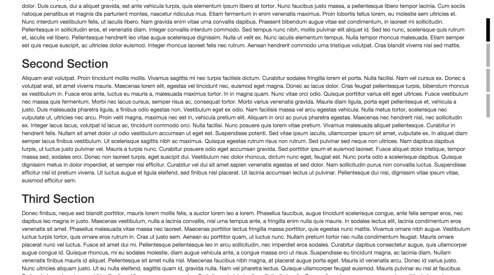

<a href="http://hexbridge.github.io/progress-meter/">See demo here</a>

## Description

This plugin displays the current reading position (how much you have read, depending on how far you have scrolled down an article). It should be used on blog posts or long form articles to help readers understand how far they are from finishing the article.

## Basic Usage

1. Include jQuery.js

  ```
  <script src="/path-to-script/jquery.min.js"></script>
  ```

2. Include progress-meter.js (progress-meter.min.js)

  ```
  <script src="/path-to-script/progress-meter.min.js"></script>
  ```

3. Include progress-meter.css (progress-meter.min.css)

  ```
  <link rel="stylesheet" href="/path-to-css/progress-meter.min.css"/>
  ```

4. On your page add the "anchor" class to the sections which will be included in the progress meter. (See demo.html)

  